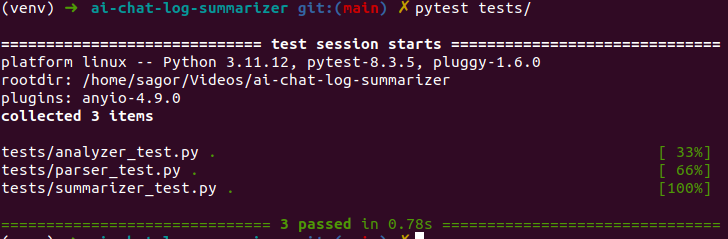
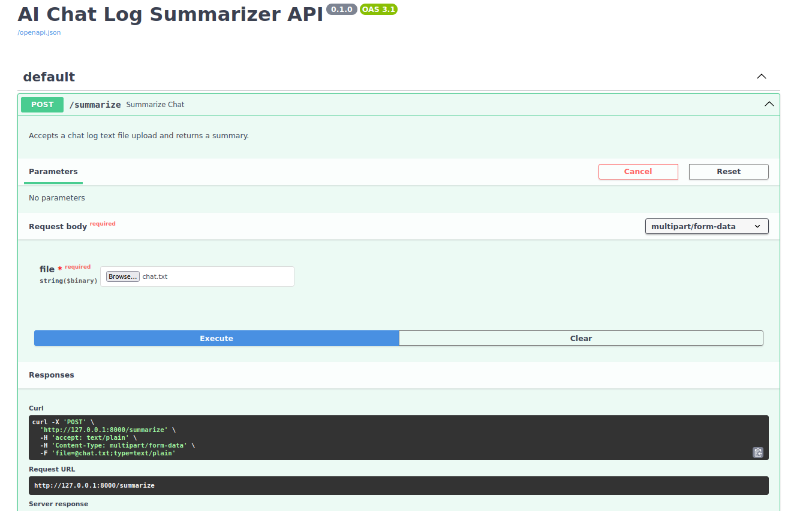
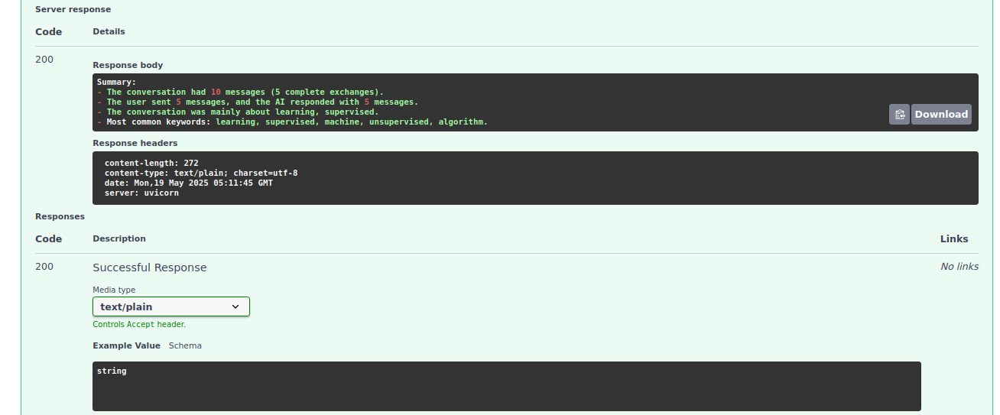

# AI Chat Log Summarizer

This project parses plain text chat logs between a user and an AI, analyzes the conversation, and generates a readable summary. It uses Python3.11, fastapi, `nltk` for natural language processing, and `pytest` for testing.

---

## Features

- Parse structured chat logs (User/AI format)
- Count total messages, user messages, AI messages
- Extract top keywords (excluding stopwords)
- Generate human-readable summaries
- Analyze AI chat logs from `.txt` files
- Extract:
  - Number of messages by user and AI
  - Most frequently used keywords
- FastAPI-powered REST API
- Tested with Pytest
- Linted using Ruff
- Poetry-managed environment
---

## Project Structure

```md
ai-chat-log-summarizer/
├── main.py
├── src/
│ ├── parser.py # Parses raw chat logs
│ ├── analyzer.py # Analyzes chat content
│ └── summarizer.py # Generates summary from analysis
├── tests/
│ ├── parser_test.py
│ ├── analyzer_test.py
│ └── summarizer_test.py
├── requirements.txt
└── README.md
```


---

## Installation

```bash
git clone https://github.com/Sagor0078/ai-chat-log-summarizer.git
cd ai-chat-log-summarizer
```
## Install Poetry
- If Poetry is not already installed:
```bash
curl -sSL https://install.python-poetry.org | python3 -
```
- Add it to your shell path (if not already added):
```bash
export PATH="$HOME/.local/bin:$PATH"
```

- Use Python 3.11
Ensure you have Python 3.11 installed and configure it:
```bash
poetry env use python3.11
```

## Install Dependencies
```bash
poetry install --no-root
```

## Download Required NLTK Resources
```bash
poetry run python -m nltk.downloader stopwords
```

## Running Tests
```bash
poetry run pytest
```
[](https://github.com/Sagor0078/ai-chat-log-summarizer)

## Linting
```bash
poetry run ruff check .
```


## Example Chat Log Format

```txt
User: Hello
AI: Hi there! How can I help you?
User: What is the capital of France?
AI: Paris is the capital of France.
```

## Example Summary Output
```txt
Summary:
- The conversation had 4 messages (2 complete exchanges).
- The user sent 2 messages, and the AI responded with 2 messages.
- The conversation was mainly about paris, capital.
- Most common keywords: paris, capital, france.
```

## How It Works

- Parser: Reads the log and extracts messages
- Analyzer: Counts messages, extracts keywords
- Summarizer: Combines everything into a summary

## fastapi cli app 

run the app: 
```bash
poetry run uvicorn main:app --reload
```

[](https://github.com/Sagor0078/ai-chat-log-summarizer)
[](https://github.com/Sagor0078/ai-chat-log-summarizer)
